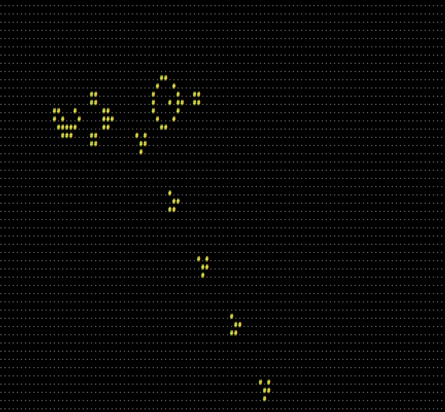

# Conway's game of life in the console

## Features
  * Allows for an arbitary grid size unlike other programs
  * Memory efficent - it only stores the coordinates of cells that are alive
  * Can save and load files
  * Can be run purely in terminal - makes it better than many other tools that either require Tk or a GUI
  * Support for both Windows and Linux


## File structure
  main.py - access point for the program  
  conway_cli.py - command line wrapper around main.py  
  /saves (or make another folder) - folder for saving files  
  util.py - utility functions used in the script  
  game.py - the main implementation of the game  

## How to play - keybindings
  Use WASD/wasd/arrow keys to move the cursor and screen  
  Use T/t to toggle if a cell is dead or alive  
  Use +/- to toggle the speed of the simulation  
  Use ' ' (space) to pause or unpause the simulation  
  Use F/f to iterate forward one generation  
 Control+C to terminate and save

## Need to know
  At the top of the file 'main.py', change the variable declarations to save and load from a different file  
  The save file is a list of coordinates in csv format of all the cells that are alive 

  **The game is initially paused when data is loaded from a file!**


## Running the game  
  Run the file `python3 main.py` and/or change the save and load files at the top of the file

  Run the file `python3 conway_cli.py` for an empty sandbox
  Run `python3 conway_cli.py --help` for help

## Pictures and examples
  `$ python3 conway_cli.py -l saves/glider_gun.csv `

  

## Dependency Graph using Mermaid

  ```mermaid
  graph TD;
  main.py-->game.py;
  main.py-->util.py;
  conway_cli.py-->main.py;
  main.py-->external_save_and_load_files;
  conway_cli.py-->external_command_line_args;
  ```
